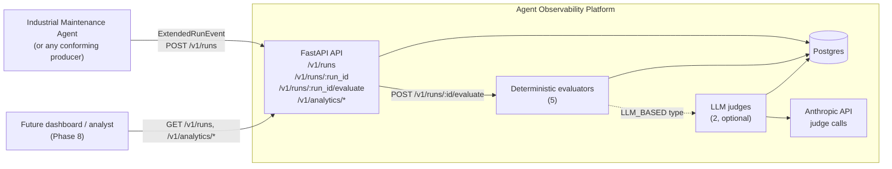
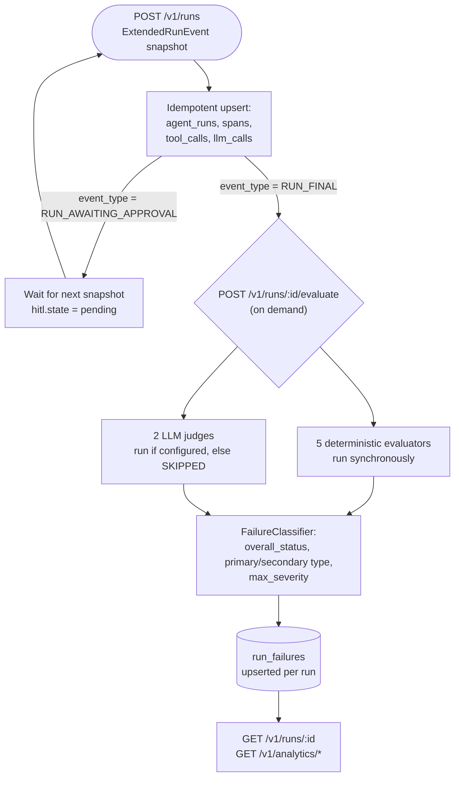

# Agent Observability Platform

## Problem Statement

Production LLM agents fail in ways that are easy to miss: a tool call succeeds but returns nothing useful, a trajectory skips a required step, an answer states a claim the evidence doesn't support, a consequential action gets approved that shouldn't have been. Most agent projects only have their own logs to tell that story, which means runtime success (the agent didn't crash) and behavioral correctness (the agent didn't lie, cut corners, or overstep) get silently conflated.

This project is a production-oriented, agent-agnostic observability and evaluation platform. It ingests structured run telemetry from an agent through a versioned wire contract, persists it relationally, evaluates it both deterministically and via LLM judges, classifies failures into a shared taxonomy with centrally-computed severity, and exposes all of it through a stable query and analytics API. It was built to observe a real companion agent — the [Industrial Maintenance Agent](../industrial-maintenance-agent) — but its core telemetry contract makes no assumptions about that agent's internals: any producer that can emit the contract can be observed by this platform without a single line of platform code changing.

## Architecture

The platform ingests via a versioned HTTP contract and evaluates on demand, not inline with the agent's own request path — an agent stays fast; observability happens as a separate, decoupled concern.





The main implementation areas are:

- `src/obs_platform/api/` — HTTP routes and versioned response schemas.
- `src/obs_platform/telemetry/v1/` — the `ExtendedRunEvent` wire contract, enums, and the canonical fixture corpus.
- `src/obs_platform/db/` — SQLAlchemy models, migrations, and the ingestion/upsert layer.
- `src/obs_platform/evaluation/` — the deterministic evaluator registry, LLM judge clients, scenario contracts, and `FailureClassifier`.
- `src/obs_platform/telemetry/` (settings) — nested Pydantic settings for database, API, and judge configuration.

## API Surface

| Endpoint | Method | Purpose |
| --- | --- | --- |
| `/health` | GET | Liveness plus real Postgres connectivity (`503` if the DB is unreachable). |
| `/v1/runs` | POST | Ingest one `ExtendedRunEvent` snapshot. Idempotent — re-posting the same run upserts, never duplicates. |
| `/v1/runs` | GET | Paginated, filterable run list (`status`, `scenario_id`, `agent_version`, `model`, time range, plus `overall_status`/`primary_failure_type` once evaluated). |
| `/v1/runs/{run_id}` | GET | Full run detail: trajectory (spans/tool calls/LLM calls), HITL state, usage, current evaluation and failure summary. |
| `/v1/runs/{run_id}/evaluate` | POST | Run the full evaluator registry against a run on demand; persists results and returns the outcome. |
| `/v1/analytics/overview` | GET | Runtime success rate, behavioral pass rate (kept separate — see below), latency, aggregate token/cost. |
| `/v1/analytics/tools` | GET | Per-tool call volume, failure rate, latency. |
| `/v1/analytics/usage` | GET | Agent-side token/cost, grouped by model and by LLM call type. |
| `/v1/analytics/failures` | GET | Failure-type and severity breakdowns across evaluated runs. |

## Telemetry Contract

`ExtendedRunEvent` (`obs_platform.telemetry.v1`) is the platform's one producer-facing contract: a versioned, module-namespaced Pydantic schema (`schema_version="1.0"`) carrying a run's spans, tool calls, LLM calls, HITL state, usage, and final result. Two properties make it work as a real integration boundary rather than a convenience wrapper:

- **It's a snapshot, not an event.** Each posted `ExtendedRunEvent` is a complete restatement of the run's current state, not a delta. A normal run produces one `RUN_FINAL` snapshot; a human-in-the-loop run produces a `RUN_AWAITING_APPROVAL` snapshot followed by a `RUN_FINAL` one that fully restates the run, reusing the same IDs for everything carried over. Ingestion treats a new snapshot for a known `run_id` as authoritative and upserts in place — never appends, never deletes.
- **Runtime status is orthogonal to lifecycle.** Whether a run is terminal (`event_type`), how it exited (`status: SUCCESS | TOOL_ERROR | RUNTIME_ERROR | AWAITING_APPROVAL`), and where it sits in human approval (`hitl.state`) are three independent fields — never one overloaded status enum — so a run awaiting approval is never miscounted as failed, and a rejected draft is never miscounted as an error.

Unknown fields are silently ignored (`extra="ignore"`) rather than rejected, deliberately tolerating producer/consumer version skew across the deploy boundary between an agent and this platform.

## Evaluation & Failure Classification

Every run can be evaluated on demand against a fixed registry — five deterministic checks that require no LLM, plus two optional LLM-judge checks that degrade cleanly to `SKIPPED` when no judge credentials are configured.

| Evaluator | Type | Checks | Applies to |
| --- | --- | --- | --- |
| `ToolExecutionEvaluator` | Deterministic | Every tool call in the run succeeded. | All runs |
| `StructuredOutputEvaluator` | Deterministic | The final output is a non-empty, well-formed result. | Runs with a final result |
| `TrajectoryEvaluator` | Deterministic | Required/forbidden tools, call ordering, terminal-state contract. | Golden/scenario-aware runs only |
| `PolicyEvaluator` | Deterministic | HITL authorization before any consequential action; no downstream calls after an unknown-asset stop. | All runs |
| `EvidenceEvaluator` | Deterministic | Every required evidence ID is cited in the final result. | Golden/scenario-aware runs only |
| `GroundednessJudge` | LLM-based | The final answer is supported by the evidence actually gathered. | Runs with a final result, when a judge is configured |
| `UncertaintyJudge` | LLM-based | A hypothesis isn't stated with unearned confidence. | Runs with a final result, when a judge is configured |

Findings from any evaluator resolve into one shared, seven-value failure taxonomy with a fixed severity ladder, computed centrally rather than per-evaluator:

| Failure type | Severity |
| --- | --- |
| `policy_violation` | `critical` |
| `unsupported_claim` | `error` |
| `output_validation_error` | `error` |
| `trajectory_error` | `error` |
| `tool_failure` | `error` |
| `retrieval_failure` | `warning` |
| `unknown` | *(unassigned)* |

A run's overall verdict is categorical, never a weighted score: **PASS** if every evaluator that ran reported success; **FAIL** if any completed evaluator reported a genuine failure — a critical policy violation always wins as the primary category when present; **INCOMPLETE** if an evaluator crashed and nothing else already confirmed a fail. Runtime success (`RunStatus`) and this behavioral verdict are reported and queried independently throughout the API — a run can runtime-succeed and behaviorally fail, or vice versa is structurally impossible, and neither is ever inferred from the other.

## Notable Design Decisions

- **Runtime status and behavioral evaluation are kept structurally separate.** `RunStatus` describes only whether the agent's own process completed normally; it can never mean "the agent was wrong." Whether the agent's behavior was actually correct is entirely the evaluators' and `FailureClassifier`'s job, computed independently and never backfilled into the producer's own status field.
- **Telemetry is a snapshot, not an event log.** Ingestion never needs a reconciliation pass, a delete path, or event replay — a later snapshot for a known run is always authoritative, enabling a genuinely idempotent upsert with almost no special-casing.
- **Severity is computed from one centralized table, keyed by failure type — never read off an individual evaluator's own opinion.** Whichever evaluator happens to catch a problem, the same failure type always maps to the same severity, so prioritization stays consistent regardless of detection path.
- **`INCOMPLETE` is a distinct verdict from `FAIL`.** An evaluator crashing (infrastructure) is never mislabeled as the agent misbehaving (a genuine failure) — though a confirmed failure still wins if both occur in the same evaluation.
- **The deterministic evaluation layer never depends on an LLM.** The platform's "Core Platform Complete" checkpoint runs the full evaluator registry, failure classification, and analytics API end-to-end with zero judge credentials configured. LLM judges are a strictly additive second tier, not a load-bearing dependency.
- **Agent cost and evaluation cost are separate ledgers.** The agent's own LLM usage (`llm_calls`) and judge spend (`judge_calls`) are distinct tables with distinct analytics scope, so judge cost never contaminates what the platform is trying to measure about the agent.

## Quick Start

Prerequisites:

- Python 3.12
- `uv`
- Docker and Docker Compose

Create local configuration:

```bash
cp .env.example .env
```

Bring up the stack (runs migrations, then starts Postgres and the API):

```bash
make up
```

Verify the service:

```bash
curl http://127.0.0.1:8000/health
```

LLM-judge evaluation is optional — leave `JUDGE__ANTHROPIC_API_KEY` unset in `.env` to run the platform with deterministic evaluation only; `GroundednessJudge`/`UncertaintyJudge` will report `status="skipped"` rather than failing.

## Scripted Demo

These requests use the canonical fixture corpus under `src/obs_platform/telemetry/v1/fixtures/` — synthetic but schema-real `ExtendedRunEvent` payloads, since this platform currently has no live producer traffic to point at (see Roadmap).

1. Ingest a healthy run and a policy-violating run:

```bash
curl -X POST http://127.0.0.1:8000/v1/runs \
  -H "Content-Type: application/json" \
  -d @src/obs_platform/telemetry/v1/fixtures/healthy_success.json

curl -X POST http://127.0.0.1:8000/v1/runs \
  -H "Content-Type: application/json" \
  -d @src/obs_platform/telemetry/v1/fixtures/policy_violation.json
```

2. List runs and inspect one in detail:

```bash
curl http://127.0.0.1:8000/v1/runs?limit=10

curl http://127.0.0.1:8000/v1/runs/{run_id}
```

3. Trigger evaluation on the policy-violating run and see it classified:

```bash
curl -X POST http://127.0.0.1:8000/v1/runs/{run_id}/evaluate
```

Expected shape of the response:

```json
{
  "run_id": "...",
  "overall_status": "fail",
  "evaluator_results": [
    { "name": "policy_evaluator", "passed": false, "severity": "critical", "...": "..." }
  ],
  "failure": {
    "overall_status": "fail",
    "primary_failure_type": "policy_violation",
    "secondary_failure_type": null,
    "max_severity": "critical"
  }
}
```

4. Check the platform-wide view:

```bash
curl http://127.0.0.1:8000/v1/analytics/overview
curl http://127.0.0.1:8000/v1/analytics/failures
```

## Data Provenance

All ingested telemetry in this repository is synthetic — a hand-authored, schema-valid `ExtendedRunEvent` corpus, not live production traffic. Where a fixture represents a real Industrial Maintenance Agent golden scenario (notably GS-08's human-in-the-loop work-order flow), it reuses that project's actual tool names, asset IDs, and fault codes; the remaining fixtures use plausible but invented identifiers to exercise every runtime status, HITL state, and failure path the contract defines. Mock LLM token/latency/cost figures are internally consistent (derived from a fixed formula against representative snippet lengths) but illustrative, not a claim about real provider pricing.

## Known Limitations

- **`ExecutionStatus.ERROR` and `LLMCallType.EVIDENCE_GATHERING` are defined but never exercised** by the canonical fixture corpus — both are reserved, intentional values with no fixture-driven proof yet that their code paths behave correctly end-to-end.
- **Live (non-golden) runs currently cannot be classified as `retrieval_failure` or `trajectory_error`.** `TrajectoryEvaluator` and `EvidenceEvaluator` only fire against registered `ScenarioContract`s (currently just GS-08 and one synthetic debug scenario) — a real agent's retrieval or trajectory problem on a run outside that registry produces a clean PASS today. This is the most consequential open gap in the evaluator layer.
- **LLM judge calibration is human-reviewed, not CI-asserted.** A small grounded/unsupported/ambiguous case set exists per judge, exercised via a walkthrough notebook rather than pytest assertions — deliberate, since semantic judgment quality isn't the kind of thing a hard assertion should gate.
- **No regression detection yet.** `evaluation_results` is already schema-ready for it (an append-only grain keyed in part by a reserved `regression_run_id`), but nothing currently re-runs frozen scenarios against evaluator changes to detect drift — that's Phase 7.
- **No dashboard yet.** The Query and Analytics API is deliberately dashboard-ready (explicit, additive-only response models), but the only current consumer is this README's scripted demo.
- **No live producer integration yet.** Every evaluated run in this repository comes from the fixture corpus; the platform has not yet ingested real telemetry from a running agent.

## Roadmap

- **Phase 7 — Regression Evaluation.** Re-run frozen golden scenarios against evaluator changes over time to detect behavioral drift, using the `regression_run_id` seam already reserved in the schema.
- **Phase 8 — Dashboard.** A visual consumer of the stable, additive-only Query and Analytics API.
- **Phase 9 — Telemetry Emitter Integration.** The Industrial Maintenance Agent grows a real HTTP telemetry sink emitting `ExtendedRunEvent` at this platform's `POST /v1/runs`.
- **Phase 10 — Real Integration Reconciliation.** The frozen v1 telemetry contract validated against the agent's actual emitted output, not just the synthetic fixture corpus.
- **Phase 11 — Documentation.** This README, finalized against a fully integrated system.

## Built With

FastAPI, SQLAlchemy 2.0 (async) / asyncpg, Alembic, PostgreSQL, Pydantic v2, Anthropic API (LLM judges), Docker Compose, pytest, ruff, mypy, uv.

## License

This project is MIT-licensed; see [LICENSE](LICENSE).
